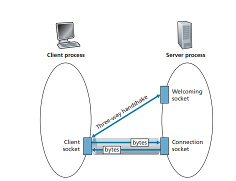
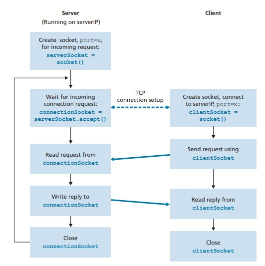
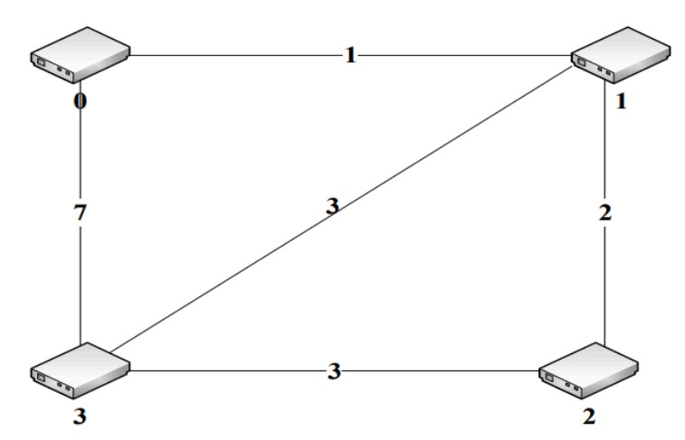

# Computer Networking Course Spring 2024
### this repo contains the computer assignments of the course instructed by Dr. Maghsoud Abbaspour Associate Professor, Shahid Beheshti University

# Client-Server (TCP Socket Programming)



The client-server directory contains simple TCP client-server code written in Python. This example demonstrates basic socket programming, where a client establishes a TCP connection to a server, sends a message, and receives a response.

### how it works




1. **Server Setup**:
    - The server creates a socket using  `serverSocket = socket().`
    - It then binds the socket to a specific port (port=x) and listens for incoming connection requests using `serverSocket.accept()`.
    - When a client connects, the server accepts the connection, creating a connectionSocket.
    
 2. **Client Setup**:
    - The client creates its socket with clientSocket = socket().
    - It initiates a connection to the server's IP address and port.
  
 3. **TCP Connection Establishment**:
    - The server and client perform a TCP handshake to establish a connection.

 4. **Data Exchange**:
    - The client sends a request using the clientSocket.
    - The server reads this request via the connectionSocket and processes it.
    - The server then writes a reply back to the client using the same connectionSocket.
    - The client reads the reply from its clientSocket.
 5. **Connection Termination**:
    - Both the server and client close their respective sockets to terminate the connection.

### files
  - server.py: Sets up a TCP server that listens for incoming client connections, receives a message, and sends a response.
  - client.py: A TCP client that connects to the server, sends a message, and waits for the server's reply.

### Getting started
    git clone https://github.com/Bahram03/Computer-Networking-Course.git
    cd Computer-Networking-Course/client-server


  **how to run**:
  1. Start the Server by running the server script to begin listening for client connections:
     
    python server.py

  2. Execute the client script to connect to the server and exchange messages:
  
    python client.py


# Distance Vector Protocol Simulation





The Distance Vector protocol is a foundational concept in networking used to determine the best path for data transfer between nodes in a network. This simulation provides a hands-on understanding of how routers use the DV protocol to update their routing tables and find the shortest path to each node.
## Project Overview
In this project, multiple nodes (routers) exchange information with their immediate neighbors, periodically updating their routing tables based on the Bellman-Ford algorithm. Each node maintains a vector of the minimum distances to every other node and shares this vector with its neighbors, enabling each node to build a comprehensive view of the network topology.
## Key Concepts
- **Routing Table**: Each router maintains a table that contains the cost to reach every other router in the network.
- **Distance Vector**: The list of minimum distances from a router to every other router.
- **Bellman-Ford Algorithm**:  Used to calculate the shortest path between nodes, considering the total cost.

### files
- **main.c**: The primary file containing the simulation code.
- **router.h**: Header file defining the data structures and function prototypes used in the simulation.
- **router.c**: Contains the implementation of the functions declared in router.h.

### Getting started
    git clone https://github.com/Bahram03/Computer-Networking-Course.git
    cd Computer-Networking-Course/distance vector protocol simulation

**how to run**:
1. Compile the code:

  ```
  gcc -c DV.c
  gcc -c node*.c
  gcc DV.o node0.o node1.o node2.o node3.o -o simulation
  ```
2. Run the simulation:
  ```
  ./simulation
  ```


  
